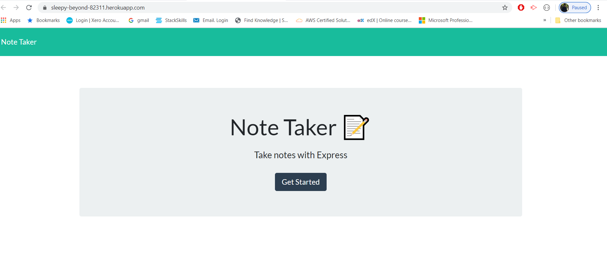
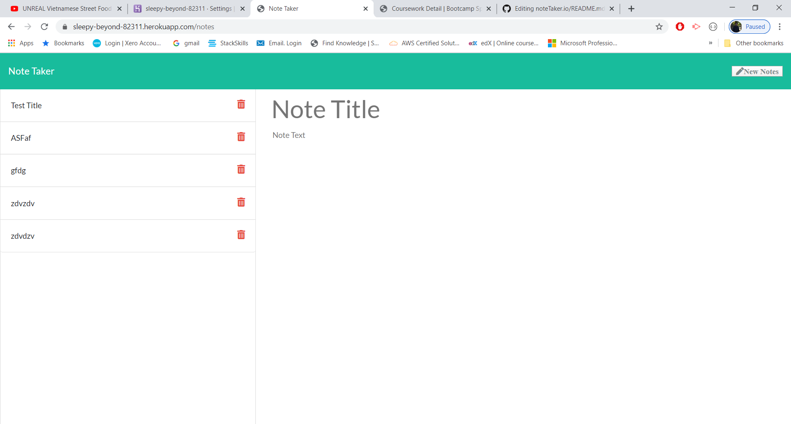

# Note Taker Application

## User Story

As a user, I want to be able to write and save notes.

I want to be able to delete notes I've written before, so that i can organize my thoughts and keep track of tasks I need to complete

## Description

An application to write, save, and delete notes. This application will use an express backend and save and retrieve note data from a JSON file.

## Installation
* Check for package.json file in the root folder, if avaialble, run the node CLI command 'npm install'.
* The following dependencies must be installed.
  * node dependencies used:
      1. express
      2. uuid
      

## Application Snapshots

## Application Functionality

### URL of the deployed application: https://sleepy-beyond-82311.herokuapp.com/
